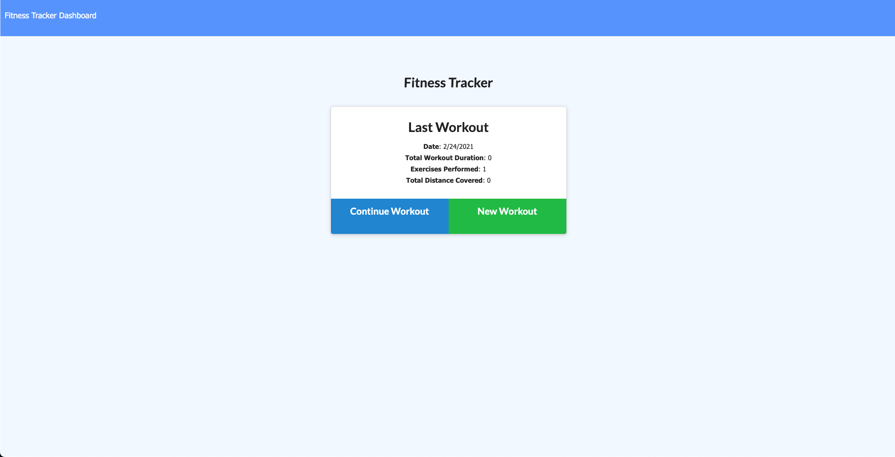

# Description
Project 17 required me to build out the MVC parameters for a fitness workout logger that takes in new exercises and uses MongoDB with Mongoose to log them to the database which can then be analyzed in the app's dashboard that has multiple graphic views of the different workouts.

The more labor intensive parts included setting up the server, routing for API and HTML, and Heroku deployment. 

# Installation
To install this application, first, branch the Github Repo and clone the repo to your computer. Then, you will need to install the node dependencies which can be done by running the npm install command in your terminal.

After the dependencies have been installed, you will need to populate your MongoDB database by running NPM Run Seed. Once filled in, you can start the server and use the program

# Usage
Once everything has been set up, the application can be launched by running the command node server.js. You will then need to visit the local host URL for the port that you have set up for this application. Once loaded in the browser, you can either click the dashboard page to view the workout stats on the graphs provided or add/contnue a workout by clicking the buttons to add or update a new workout on the home page. When adding a new workout, ensure to click complete once you have filled everything in as if you click add exercise, then it will add a blank instance of a workout with 0 for the numbers and no string for the title/name area.

# Questions
For any questions related to this applicaiton, please contact me at: williamhheyer@gmail.com.

Please use this link to access my Github Profile: https://github.com/WillHeyer

Please use this link to access my Heroku Page:  https://sleepy-dusk-51174.herokuapp.com/
